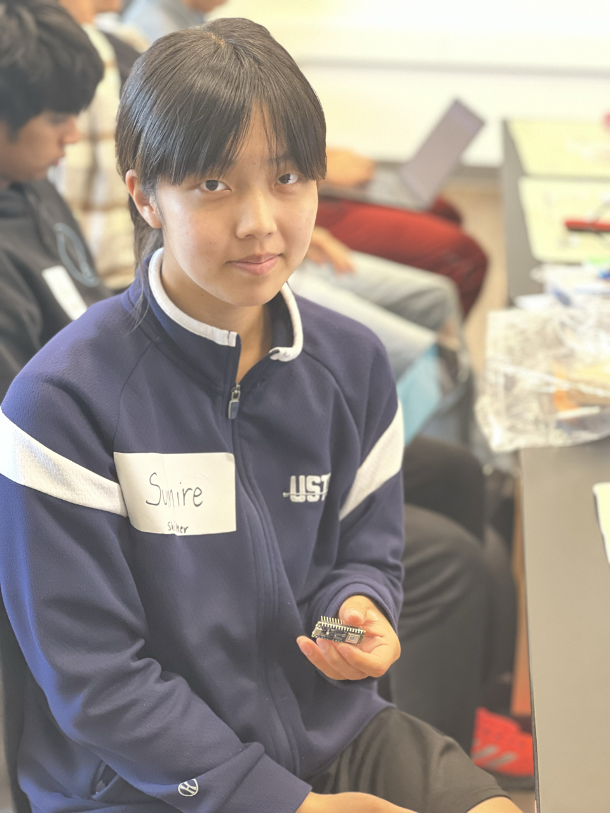

# ML Fitness Tracker
<!--- Replace this text with a brief description (2-3 sentences) of your project. This description should draw the reader in and make them interested in what you've built. You can include what the biggest challenges, takeaways, and triumphs from completing the project were. As you complete your portfolio, remember your audience is less familiar than you are with all that your project entails! -->

<!--- ("Add a Hook Here* Something like: Ever wish you could track your fitness progress? Want a friend/device to count your never-ending reps? (Well,) Look no further. ). An Arduino powered, BLE (Bluetooth Low Energy) based fitness tracker that detects numerous exercises and records the number of repetitions on a user interface (Insert Name Here). -->

Ever wish you could track your fitness progress? Want a friendly device to count your never-ending reps? Well, Look no further. GetFit is an Arduino powered, BLE (Bluetooth Low Energy) based fitness tracker that detects numerous exercises and records the number of repetitions on a user interface (Insert Name Here).

| **Engineer** | **School** | **Area of Interest** | **Grade** |
|:--:|:--:|:--:|:--:|
| Sumire T | Homestead High School | Electrical Engineering | Incoming Senior

<!--- **Replace the BlueStamp logo below with an image of yourself and your completed project. Follow the guide [here](https://tomcam.github.io/least-github-pages/adding-images-github-pages-site.html) if you need help.** -->

{:height="50%" width="50%"}
  
# Final Milestone
<!--- For your final milestone, explain the outcome of your project. Key details to include are:
- What you've accomplished since your previous milestone
- What your biggest challenges and triumphs were at BSE
- A summary of key topics you learned about
- What you hope to learn in the future after everything you've learned at BSE

**Don't forget to replace the text below with the embedding for your milestone video. Go to Youtube, click Share -> Embed, and copy and paste the code to replace what's below.**

<iframe width="560" height="315" src="https://www.youtube.com/embed/F7M7imOVGug" title="YouTube video player" frameborder="0" allow="accelerometer; autoplay; clipboard-write; encrypted-media; gyroscope; picture-in-picture; web-share" allowfullscreen></iframe> -->
Demo Video:


https://github.com/sumiretakeya/Sumire_Bluestamp_Portfolio/assets/107578593/f6969769-0264-4eab-8673-bed45a49b241


# Second Milestone
<!--- For your second milestone, explain what you've worked on since your previous milestone. You can highlight:
- Technical details of what you've accomplished and how they contribute to the final goal
- What has been surprising about the project so far
- Previous challenges you faced that you overcame
- What needs to be completed before your final milestone -->

<!--- For my second milestone, I trained my machine learning model from my collected data from two exercises on Edge Impulse, an embedded machine learning operations platform, and was able to get an accuracy of 96.64%, which I then proceeded to deploy into an Arduino zip library.  (An automatically generated neural network with the best settings for the model)

I then made a new project in Firebase, an app development platform, to create a hosting site between the user interface and the Arduino bluetooth connection. I initialized the newly created project by running the command, "firebase init".

Additionally, I uploaded the original source code of the model library, to understand how the user interface establishes a Bluetooth Low Energy connection with the Arduino and works like a counter.

I worked with the original source code and library, which I knew would upload without external errors, before uploading my own code and library into the Arduino Nano, (Reason Here).

After uploading both the original source code and library zip file to the IDE, I uploaded it to the Arduino Nano.

I added the Firebase configuration to the script.js file of the original source file.

I then opened the website created through Firebase and enabled "Experimental Web Platform Features" by going to "chrome://flags" to access Bluetooth using Chrome.

When accessing the webpage "https://mlfitnesstracker.web.app", which I created through Firebase, the user interface worked seamlessly, as I was able to successfully connect the Arduino Nano with a Bluetooth connection (the feature), and the counter of exercises worked, meaning that if one holding the Arduino Nano were to do one arm circle, the counter on the user interface would display an additional arm circle.

For my next milestone, I will use my own code and library from my machine learning model to set up the user interface and exercise counter. --> 
For my second milestone, I trained my machine learning model from my collected data from two exercises on Edge Impulse, an embedded machine learning operations platform, and was able to get an accuracy of 96.64%, which I then proceeded to deploy into an Arduino zip library.  (An automatically generated neural network with the best settings for the model)

I then made a new project in Firebase, an app development platform, to create a hosting site between the user interface and the Arduino bluetooth connection. I initialized the newly created project by running the command, "firebase init".

Additionally, I uploaded the original source code of the model library, to understand how the user interface establishes a Bluetooth Low Energy connection with the Arduino and works like a counter.I worked with the original source code and library, which I knew would upload without external errors, before uploading my own code and library into the Arduino Nano, (which I wasn't sure...). After uploading both the original source code and library zip file to the IDE, I uploaded it to the Arduino Nano.

I added the Firebase configuration to the script.js file of the original source file.

I then opened the website created through Firebase and enabled "Experimental Web Platform Features" by going to "chrome://flags" to access Bluetooth using Chrome.

When accessing the webpage "https://mlfitnesstracker.web.app", which I created through Firebase, the user interface worked seamlessly, as I 
was able to successfully connect the Arduino Nano with a Bluetooth connection (the feature), and the counter of exercises worked, meaning that if one holding the Arduino Nano were to do one arm circle, the counter on the user interface would display an additional arm circle.

For my next milestone, I will use my own code and library from my machine learning model to set up the user interface and exercise counter.

<!--- **Don't forget to replace the text below with the embedding for your milestone video. Go to Youtube, click Share -> Embed, and copy and paste the code to replace what's below.**

<iframe width="560" height="315" src="https://youtu.be/xJzyyJrNCDw" title="YouTube video player" frameborder="0" allow="accelerometer; autoplay; clipboard-write; encrypted-media; gyroscope; picture-in-picture; web-share" allowfullscreen></iframe> -->

# First Milestone
<!--- For your first milestone, describe what your project is and how you plan to build it. You can include:
- An explanation about the different components of your project and how they will all integrate together
- Technical progress you've made so far
- Challenges you're facing and solving in your future milestones
- What your plan is to complete your project

**Don't forget to replace the text below with the embedding for your milestone video. Go to Youtube, click Share -> Embed, and copy and paste the code to replace what's below.** -->
 
My project is the machine-learning fitness tracker, a device one attaches to their arm that is powered by an Arduino through BLE (Bluetooth Low Energy) connection that detects different exercises (Ex: jumping jacks, squats, etc.) and ultimately records the number of repetitions on a user interface. 
For my first milestone, I first set up the Arduino (a microcontroller) by connecting it to Edge Impulse, a platform that uses embedded machine learning. I got the Arduino to be recognized by running the command "edge-impulse-daemon" on the terminal. 

To collect data in a similar manner to the actual armband, I made a prototype case by gluing cardboard pieces together. 
For the placement of the armband, I placed it in the middle of the lower part of the arm to accurately record the movements of the exercises. 
I collected data on two exercises: arm circles and lateral rises. I recorded the exercises on the Arduino at 30 second intervals. I repeated this four times for a total of 2 minutes of data per exercise then went around collecting data from two other people besides myself.
A challenge that I faced was finding a way to take accurate data with the armband, as I initially attached the armband too loosely on the upper part of the arm, which caused the Arduino unable to detect accurate movement. To solve this, I attached the armband on the middle of the lower part of the arm. 

Another challenge that I faced was initially only recording data from myself, which resulted in the model having a 100% accuracy, which meant that it was overtrained with my movements, and would not be able to detect the same exercise if another person were to try it. To solve this, I collected data from more people. 

For the next milestone, I will train the machine learning model on Edge Impulse and test it until I get good accuracy. 
<iframe width="560" height="315" src="https://www.youtube.com/embed/xJzyyJrNCDw" title="YouTube video player" frameborder="0" allow="accelerometer; autoplay; clipboard-write; encrypted-media; gyroscope; picture-in-picture; web-share" allowfullscreen></iframe>

# Schematics 
<!--- Here's where you'll put images of your schematics. [Tinkercad](https://www.tinkercad.com/blog/official-guide-to-tinkercad-circuits) and [Fritzing](https://fritzing.org/learning/) are both great resoruces to create professional schematic diagrams, though BSE recommends Tinkercad becuase it can be done easily and for free in the browser. -->

# Code
<!--- Here's where you'll put your code. The syntax below places it into a block of code. Follow the guide [here]([url](https://www.markdownguide.org/extended-syntax/)) to learn how to customize it to your project needs. -->
Here is the code that I used for this project. 

Arduino Code:
```c++
*Code Here*
```
UI Code:
```c++
*Code Here*
```
GitHub Link to Source Code:
https://github.com/CodersCafeTech/GetFit

<!--- ```c++
void setup() {
  // put your setup code here, to run once:
  Serial.begin(9600);
  Serial.println("Hello World!");
}

void loop() {
  // put your main code here, to run repeatedly:

}
``` -->

# Bill of Materials
<!---- Here's where you'll list the parts in your project. To add more rows, just copy and paste the example rows below.
Don't forget to place the link of where to buy each component inside the quotation marks in the corresponding row after href =. Follow the guide [here]([url](https://www.markdownguide.org/extended-syntax/)) to learn how to customize this to your project needs. -->
Here is the list of materials that I used for my project. One can either choose to make their own DIY case or 3D print it out. The cost breakdown of both options are listed below:

| **Part** | **Note** | **Price** | **Link** |
|:--:|:--:|:--:|:--:|
| Arduino Nano 33 BLE Sense with Headers | What the item is used for | $43.50 | <a href="https://store-usa.arduino.cc/products/arduino-nano-33-ble-sense-with-headers"> Link </a> |
| Anker PowerCore 5000 Portable Charger | Hardware, What the item is used for | $17.99 | <a href="https://a.co/d/bzSM61g"> Link </a> |
| 18" x 2" Cinch Strap | What the item is used for | $18.53 | <a href="https://a.co/d/isdqSpr"> Link </a> |
| Cardboard | Build a relatively sturdy case if 3D case is not an option |$0 - $9.81 | <a href="https://www.staples.com/Corrugated-Sheet-24-x-48-5-Bundle-SP2448/product_946708?cid=PS:GS:SBD:PLA:MS&gclid=CjwKCAjw-b-kBhB-EiwA4fvKrGfs_8eTA5h1a_B92vL9k0gwqHrUV5KCjFd3ZyT2keSoWiSbKTE8qhoCt64QAvD_BwE"> Link </a> |
| 3D Case | What the item is used for | $Price | <a href="https://www.amazon.com/Arduino-A000066-ARDUINO-UNO-R3/dp/B008GRTSV6/"> Link </a> |

<!--- # Dimensions of 3D Case -->


<!--- # Dimensions of DIY Case -->

# Other Resources

Link to Helpful Websites Used to Complete this Project:
https://docs.google.com/document/d/1gp4OPdYfRvL58Zp1qBMSvtmFS1bA3fpqKweGuT3sNpk/edit?usp=sharing

Other:


<!--- # Other Resources/Examples
One of the best parts about Github is that you can view how other people set up their own work. Here are some past BSE portfolios that are awesome examples. You can view how they set up their portfolio, and you can view their index.md files to understand how they implemented different portfolio components.
- [Example 1](https://trashytuber.github.io/YimingJiaBlueStamp/)
- [Example 2](https://sviatil0.github.io/Sviatoslav_BSE/)
- [Example 3](https://arneshkumar.github.io/arneshbluestamp/)

To watch the BSE tutorial on how to create a portfolio, click here. -->
